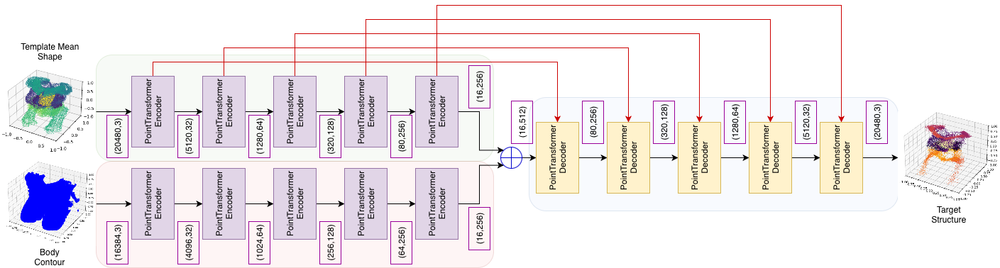

# From Surface to Viscera: 3D Estimation of Internal Anatomy from Body Surface Point Clouds

## Introduction
This repo is the source code of the paper: **"From Surface to Viscera: 3D Estimation of Internal Anatomy from Body Surface Point Clouds"**. You can find the paper [here](https://openreview.net/forum?id=945iFNHxU7&referrer=%5Bthe%20profile%20of%20Mattias%20P%20Heinrich%5D(%2Fprofile%3Fid%3D~Mattias_P_Heinrich1)).
This repo introduces the implementation of DeformingPointTransformer. The DeformingPointTransformer is a deep learning framework designed to predict a patient's internal 
anatomical structures using only their external body surface as an input. By utilizing 3D point cloud data and a transformer-based architecture, this project aims to optimize clinical imaging workflows.

This repo utilizes two other Github repos: 
  1. Original Implementation of PointTransformer by Zhao et. al (2021). [here](https://github.com/POSTECH-CVLab/point-transformer?tab=readme-ov-file)
  2. ChamferDistance3D implementation module by Lin et. al (2023). [here](https://github.com/Zhang-VISLab/NeurIPS2023-InfoCD/tree/main/codes/Chamfer3D)

Follow the enviromental setup in PointTransformer repo described in [here](https://github.com/POSTECH-CVLab/point-transformer?tab=readme-ov-file).

## Methods

The system employs a sophisticated Encoder-Decoder architecture specifically optimized for geometric point cloud data

### Dual-Branch Encoder

The architecture features two distinct encoding branches that process the Body Surface point cloud and a Template Mean Shape simultaneously. 
**PointTransformer Encoder**: Each branch consists of multiple encoder blocks that downsample the data through various stages (e.g., from 20,480 points down to 16)
**Core Blocks:** Each encoder unit includes Linear layers, Transformer blocks, and Farthest Point Sampling (FPS) to reduce density while maintaining shape features.
**Feature Extraction:** The model uses kNN (k-Nearest Neighbors) and MLP groupings followed by Max Pooling to capture local geometric context

### PointTransformer Decoder

The decoder reconstructs the internal organs by merging features from both encoder branches.
• **Upsampling:** It utilizes Interpolation layers to increase point density,.
• **Skip Connections:** Information is passed directly from encoder stages to corresponding decoder stages to preserve spatial detail.
• **Refinement:** Similar to the encoder, the decoder uses Transformer and Linear layers to refine the coordinates of the predicted internal structures.

